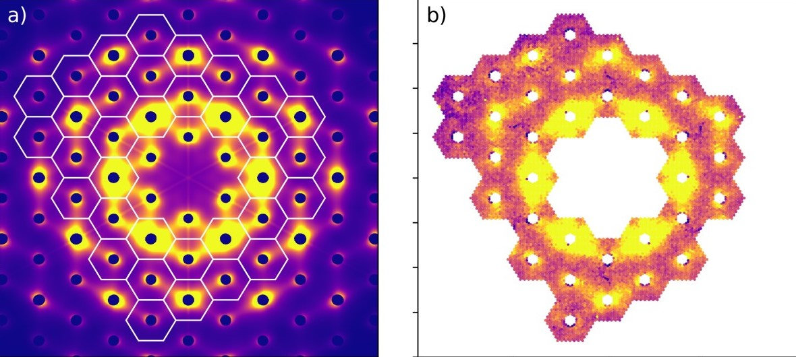

# Patrick Hildebrandt

### Hi, welcome to my profil!

I am a former physicist who switched from science to data analytics. In my repositories you will find a selection of projects from different topics. 

 

<h3 align="left">Languages and Tools:</h3>

               

